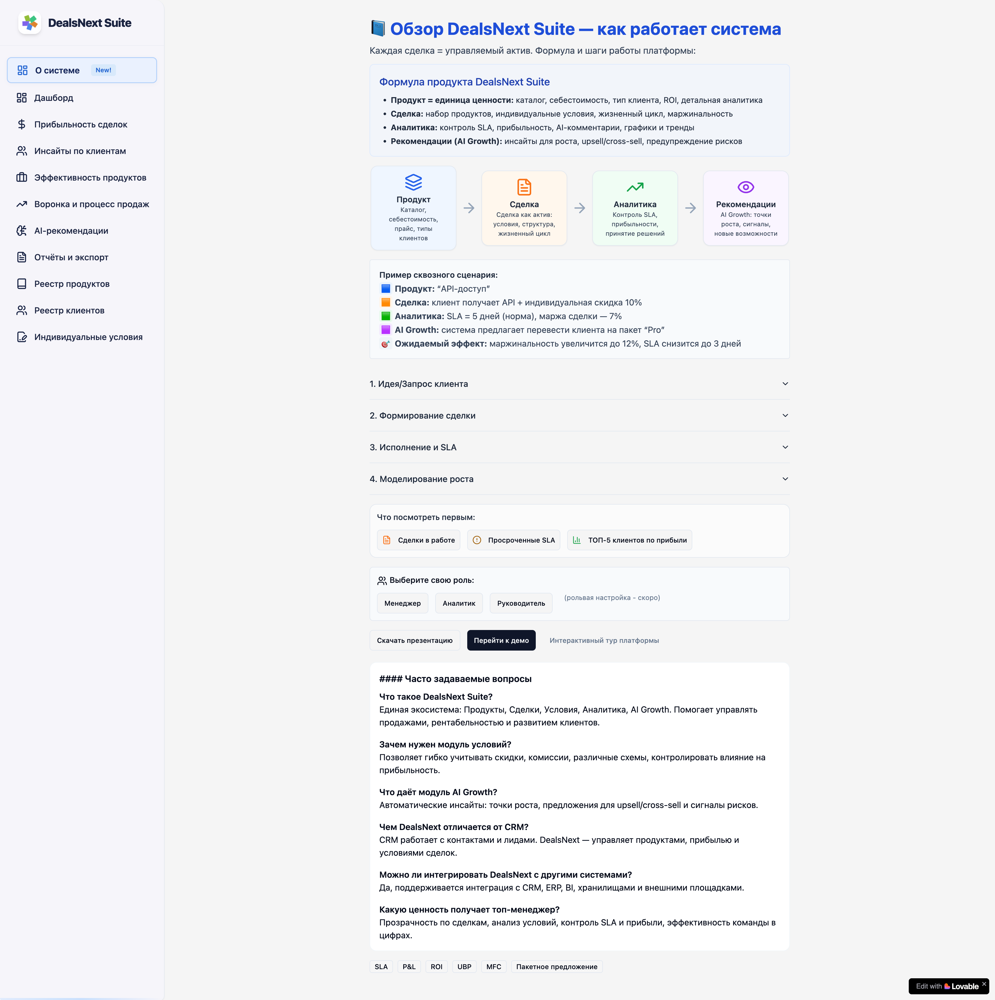
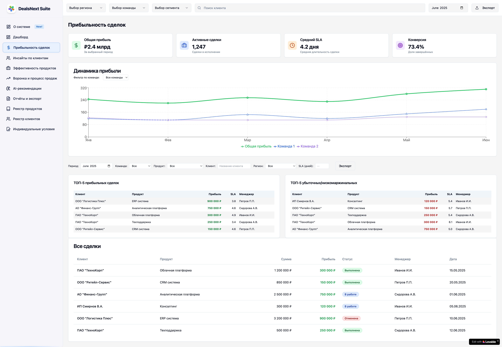
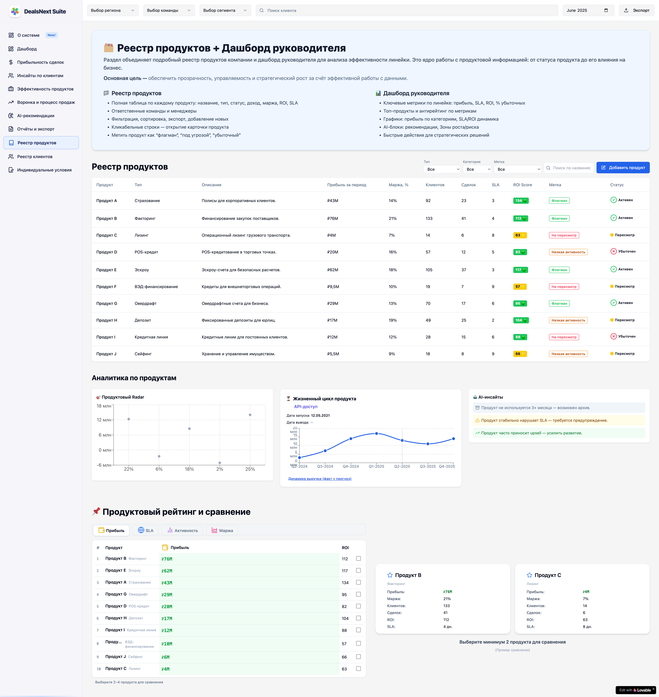
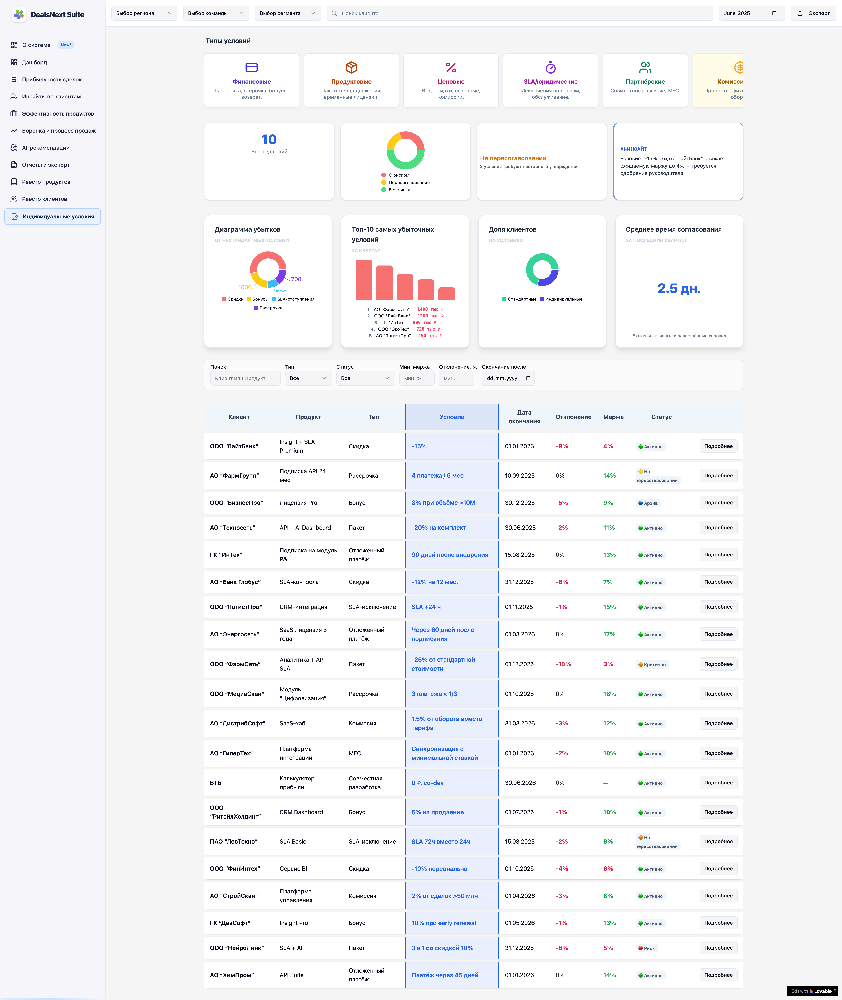
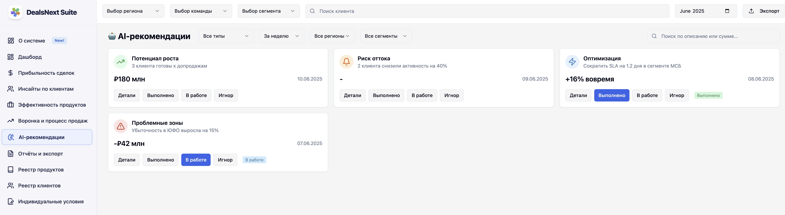

<div align="center">

# DealsNext Insight Hub

**B2B sales-analytics & deal-intelligence dashboard — React 18 · TypeScript · Vite · shadcn/ui**

[](LICENSE)
[](https://react.dev/)
[](https://www.typescriptlang.org/)
[](https://vitejs.dev/)
[](https://tailwindcss.com/)
[](https://ui.shadcn.com/)
[](docs/IMPROVEMENTS.md)

**[Live Demo](https://dealsnext-insight-hub-02.lovable.app/)** · **[UI Tour](docs/UI_OVERVIEW.md)** · **[Architecture](docs/ARCHITECTURE.md)** · **[Product Spec](docs/PRD.md)** · **[Engineering Roadmap](docs/IMPROVEMENTS.md)** · **[Русская версия](README.ru.md)**



</div>

---

## Why this project

**DealsNext Insight Hub** is a portfolio-grade dashboard that demonstrates production-style front-end architecture for a B2B sales-analytics product. It models the kind of internal tool a sales-operations team uses every day: real-time deal tracking, client intelligence, product profitability, AI-assisted growth signals, and individual contract conditions — all stitched together in 13 composable screens.

- **13 production-style screens** covering deals, clients, products, team monitoring, sales funnel, AI recommendations, and reports.
- **AI-recommendation surface** wired into deal and client flows (upsell, cross-sell, churn risk) — currently powered by a typed mock layer ready to be swapped for a real backend.
- **Composable design system** built on top of [shadcn/ui](https://ui.shadcn.com/) — 49 primitives, Radix-based, fully themable through CSS variables.
- **Strict TypeScript** end-to-end with a typed mock data layer (`src/data/mockData.ts`) that mirrors a future REST/GraphQL contract.
- **TanStack Query** foundation in place for future server-state caching and optimistic updates.

> This is a portfolio demo. Data is mocked locally; there is no backend, no auth, no PII. See [`docs/PRD.md`](docs/PRD.md) for the product vision and [`docs/IMPROVEMENTS.md`](docs/IMPROVEMENTS.md) for the engineering roadmap.

---

## Feature tour

### Deals list


Search, filter, and sort the full pipeline. Health indicators surface SLA breaches and margin risk at a glance; cards and a dense table give the same data two readings.

### Product registry


Catalog with lifecycle, profitability forecast, and a comparison view. Drill into any product card for the full ROI and margin breakdown.

### Individual conditions


Custom discounts, installments, commissions — each contract condition re-prices the deals it touches and shows the delta against baseline profitability.

### AI growth signals


Upsell, cross-sell, and risk alerts surfaced alongside expected effect on SLA and margin. Designed to ride on top of a real recommender once the backend exists.

### Product card


Single-product deep dive with rating, ROI, margin, history, and integration hooks for downstream analytics.

---

## Tech stack

| Layer            | Choice                                          | Version |
| ---------------- | ----------------------------------------------- | ------- |
| Framework        | React                                           | 18.3    |
| Language         | TypeScript                                      | 5.5     |
| Build tool       | Vite + SWC                                      | 5.4     |
| Styling          | Tailwind CSS + `tailwindcss-animate`            | 3.4     |
| Component system | shadcn/ui (Radix primitives)                    | latest  |
| Routing          | React Router                                    | 6.26    |
| Server state     | TanStack Query                                  | 5.56    |
| Forms            | React Hook Form + Zod                           | 7.53 / 3.23 |
| Charts           | Recharts                                        | 2.12    |
| Icons            | Lucide                                          | 0.462   |
| Notifications    | Sonner                                          | 1.5     |

---

## Quick start

**Prerequisites:** Node.js 20+ and npm.

```sh
git clone https://github.com/eiler2005/dealsnext-insight-hub.git
cd dealsnext-insight-hub
npm install
npm run dev        # serves on http://localhost:8080
```

### Scripts

| Command            | Purpose                                          |
| ------------------ | ------------------------------------------------ |
| `npm run dev`      | Start the Vite dev server on port 8080           |
| `npm run build`    | Production build to `dist/`                      |
| `npm run build:dev`| Development-mode build (sourcemaps, no minify)   |
| `npm run preview`  | Preview the production build locally             |
| `npm run lint`     | Run ESLint over the source tree                  |

---

## Project structure

```
src/
├── App.tsx                    # Providers + Routes
├── main.tsx                   # Bootstrap
├── pages/                     # Route-level components (one per screen)
├── components/
│   ├── layout/                # Header, Sidebar, Layout shell
│   ├── ui/                    # shadcn/ui primitives (vendored — do not edit)
│   ├── dashboard/             # Feature: dashboard widgets
│   ├── deals/                 # Feature: deals table, cards, filters
│   ├── client-insights/       # Feature: client intelligence
│   ├── product-registry/      # Feature: product catalog
│   ├── product-effectiveness/ # Feature: product KPIs
│   ├── team-monitoring/       # Feature: team activity
│   ├── sales-funnel/          # Feature: funnel visualisations
│   ├── ai-recommendations/    # Feature: AI growth surface
│   ├── individual-conditions/ # Feature: contract conditions
│   ├── reports-export/        # Feature: report builder
│   └── overview/              # About-system widgets
├── data/mockData.ts           # Typed fixtures (future: replaced by services/)
├── hooks/                     # Cross-cutting hooks
└── lib/                       # Utilities, helpers
```

---

## Screens at a glance

| Route                       | Page                       | Purpose                                          |
| --------------------------- | -------------------------- | ------------------------------------------------ |
| `/`                         | `Dashboard`                | KPIs, AI insights, quick navigation              |
| `/about`                    | `AboutSystem`              | Onboarding & system overview                     |
| `/deals`                    | `Deals`                    | Full pipeline with filters and bulk actions      |
| `/team-monitoring`          | `TeamMonitoring`           | Activity, workload, and SLA per team member      |
| `/deal-profitability`       | `DealProfitability`        | Margin breakdown per deal                        |
| `/client-insights`          | `ClientInsights`           | Segments, trends, lifetime value                 |
| `/product-effectiveness`    | `ProductEffectiveness`     | KPIs per product line                            |
| `/sales-funnel`             | `SalesFunnel`              | Stage-by-stage funnel analytics                  |
| `/ai-recommendations`       | `AiRecommendations`        | AI-surfaced upsell, cross-sell, churn signals    |
| `/reports-export`           | `ReportsExport`            | Report builder and exports                       |
| `/product-registry`         | `ProductRegistry`          | Catalog, comparison, profit forecast             |
| `/client-registry`          | `ClientRegistry`           | Master client list with segmentation             |
| `/individual-conditions`    | `IndividualConditions`     | Custom contract terms and their impact           |
| `*`                         | `NotFound`                 | 404 fallback                                     |

Full screen-by-screen walkthrough with screenshots → [`docs/UI_OVERVIEW.md`](docs/UI_OVERVIEW.md).

---

## Documentation

| Document                                       | What's inside                                                       |
| ---------------------------------------------- | ------------------------------------------------------------------- |
| [`docs/PRD.md`](docs/PRD.md)                   | Product vision, personas, user stories, FR/NFR, success metrics     |
| [`docs/ARCHITECTURE.md`](docs/ARCHITECTURE.md) | System diagrams, layers, routing, state, data flow (current/target) |
| [`docs/UI_OVERVIEW.md`](docs/UI_OVERVIEW.md)   | Full screen tour with annotated screenshots                         |
| [`docs/IMPROVEMENTS.md`](docs/IMPROVEMENTS.md) | Engineering roadmap with priorities and acceptance criteria         |
| [`docs/adr/`](docs/adr/)                       | Architecture Decision Records                                       |
| [`CONTRIBUTING.md`](CONTRIBUTING.md)           | Local setup, branching, commits, PR checklist                       |
| [`LICENSE`](LICENSE)                           | MIT                                                                 |

---

## Status & roadmap

`v0.1` — Portfolio demo. All 13 screens are functional against a typed mock layer. There is no backend, no auth, no real AI.

The path from `v0.1` → `v1.0` is tracked in [`docs/IMPROVEMENTS.md`](docs/IMPROVEMENTS.md): typing tightening, real service layer over `mockData.ts`, route-level code splitting, Vitest + RTL coverage, CI/CD, Prettier + Husky, SEO, and a11y polish.

---

## License

Licensed under the [MIT License](LICENSE).

## Author

**Denis Ermilov** — [github.com/eiler2005](https://github.com/eiler2005)
