# Interface Overview / Обзор интерфейса

---

## 🇺🇸 English

Welcome to the DealsNextV0 interface!  
Below you will find expanded interface screenshots and descriptions of the main modules.

---

### About system (onboarding for users)

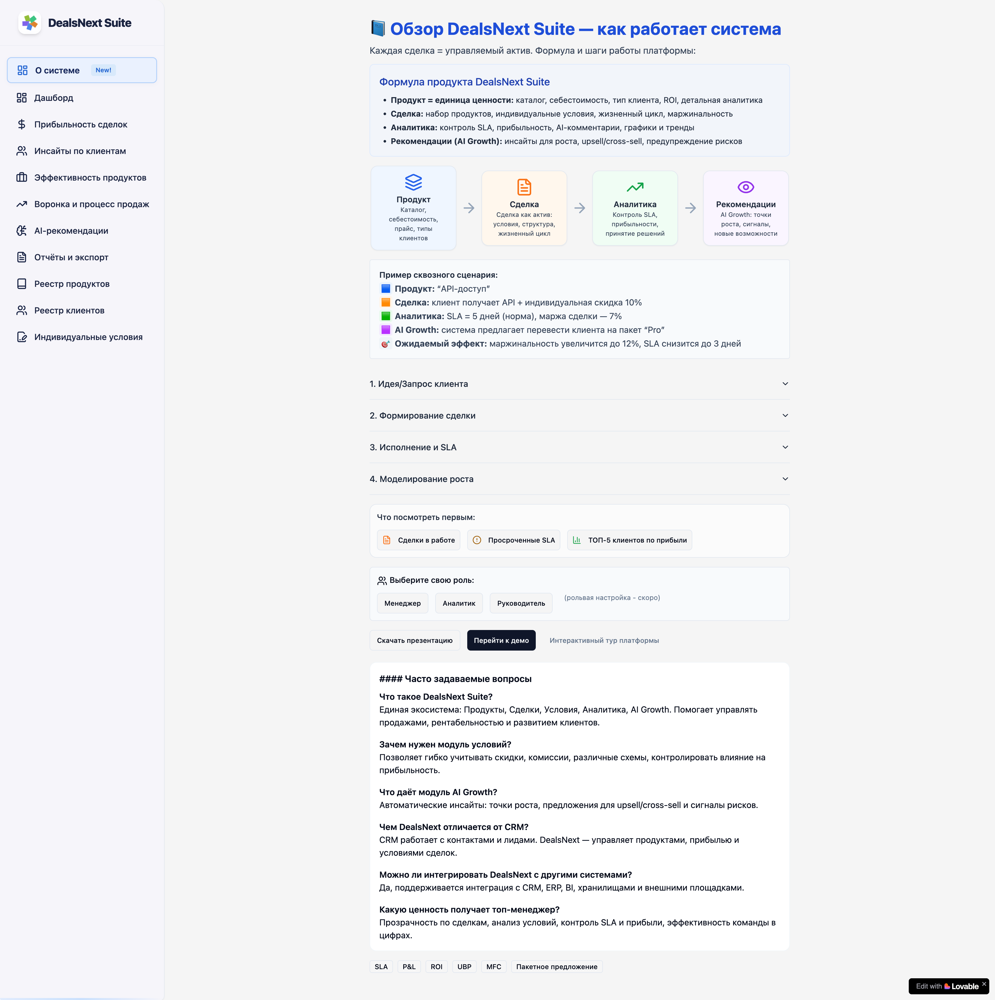

### Dashboard

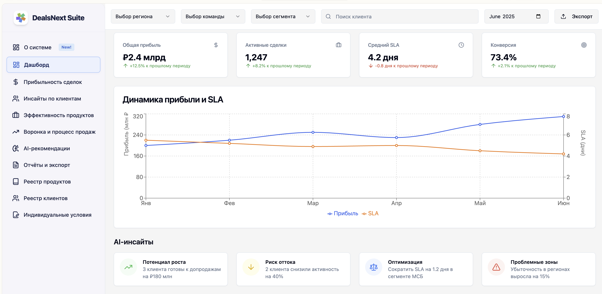

- **Live KPIs:** Quick stats and profit visualization.
- **AI Insights:** Growth recommendations and risk signals.
- **Quick Navigation:** Access to Products, Deals, Conditions, Analytics, AI Growth.

---

### Product Registry

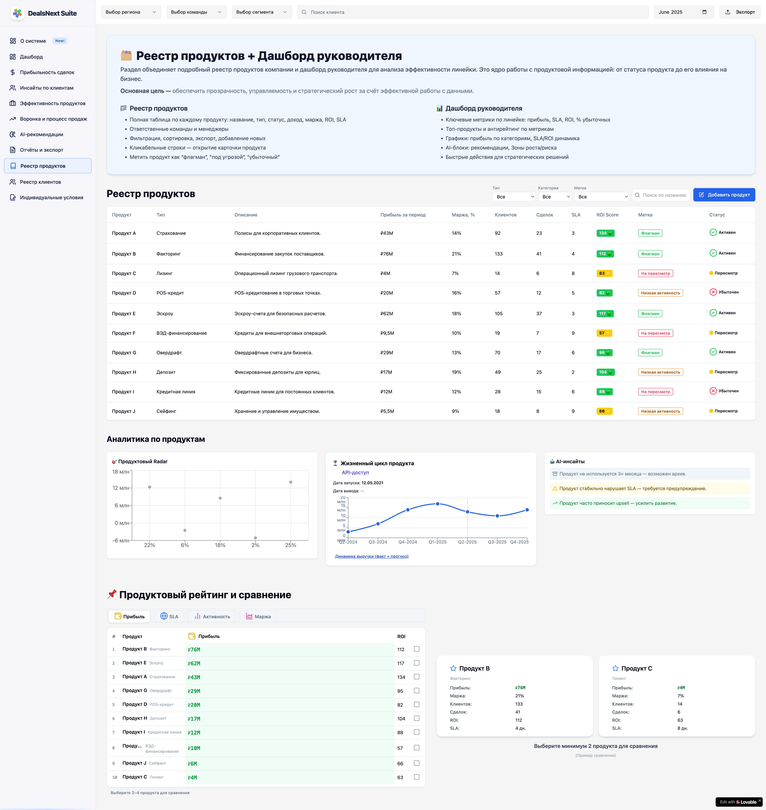

- **Product Lifecycle:** Track product performance and profit over time.
- **Comparison Table:** View, sort, and compare products.
- **Profit Forecast:** Interactive charts and analytics.

---

### Individual Conditions

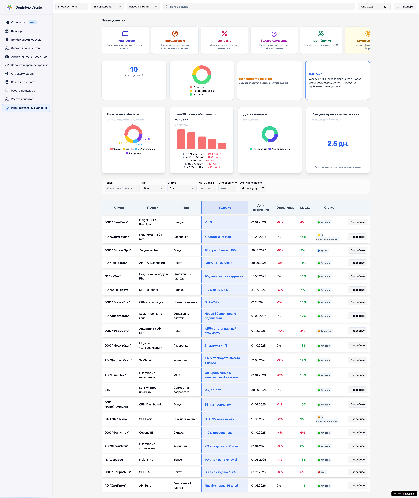

- **Custom Terms:** Discounts, installments, and commissions.
- **Impact Highlight:** Deals profitability recalc in real time.

---

### AI Growth Module

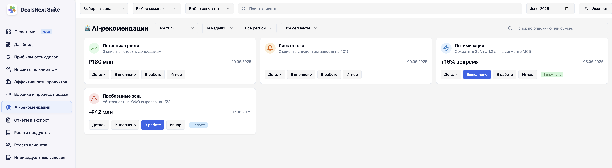

- **Automatic Insights:** Upsell/cross-sell opportunities, risk alerts.
- **Effect Forecast:** Visualized SLA and margin improvement.

---

### Deals List

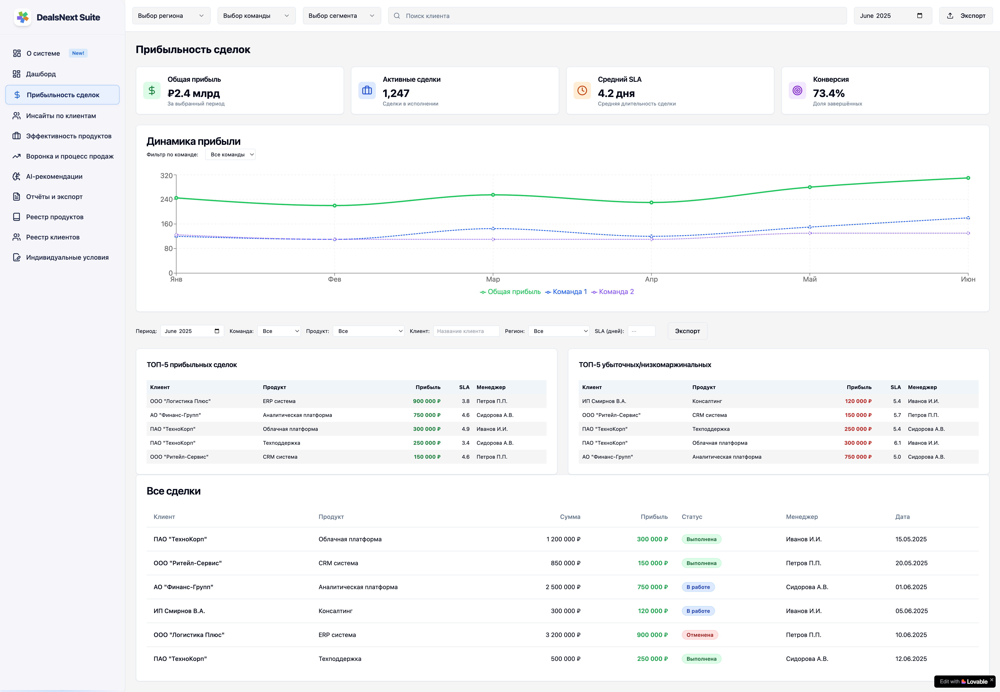

- **Full deal list:** Easy navigation and filtering.
- **Status Indicators:** Understand deal health at a glance.
- **Bulk Actions:** Quickly update, export, or archive deals.

---

### Analytics Overview

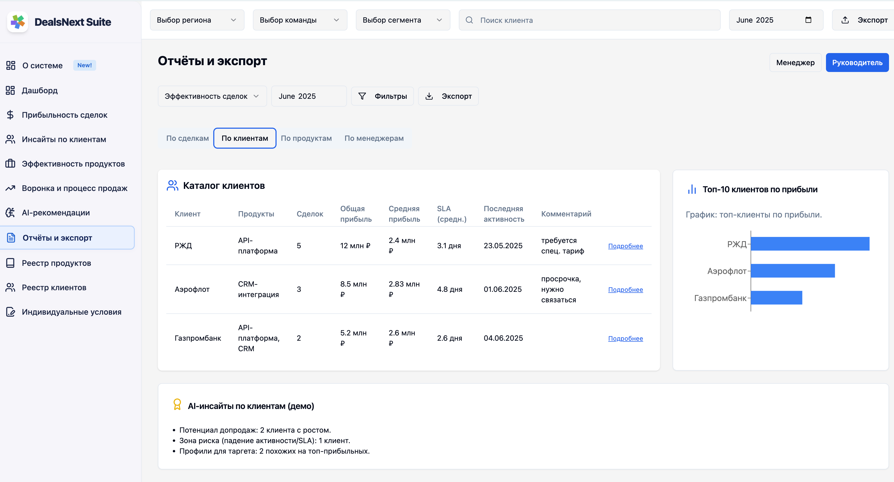

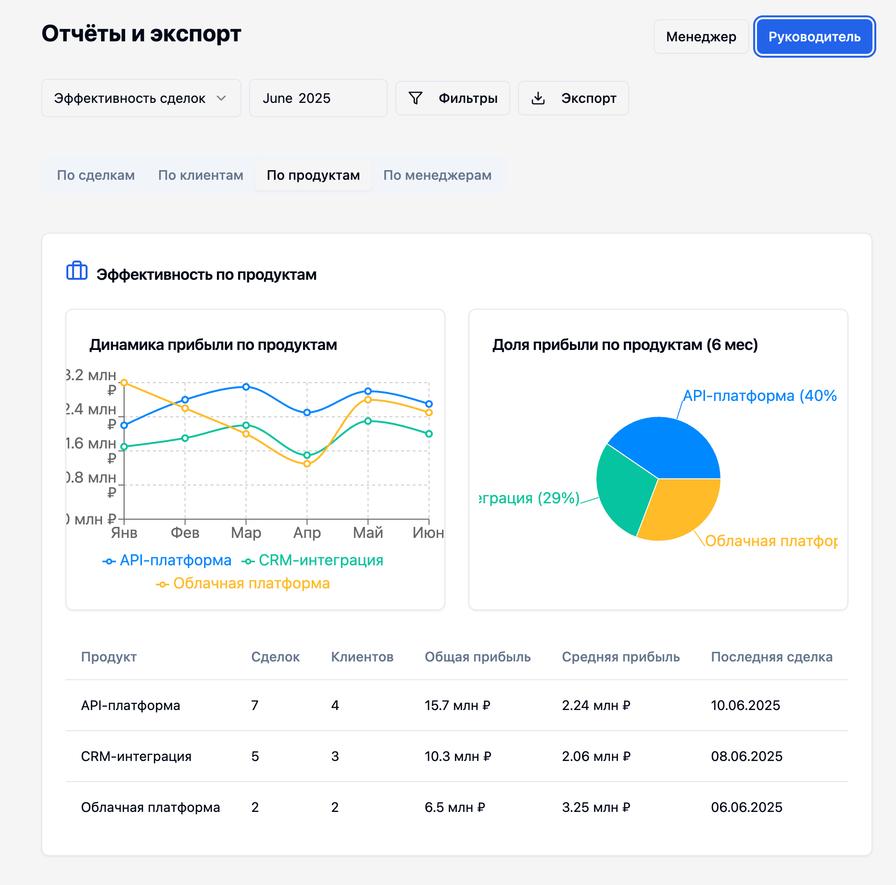

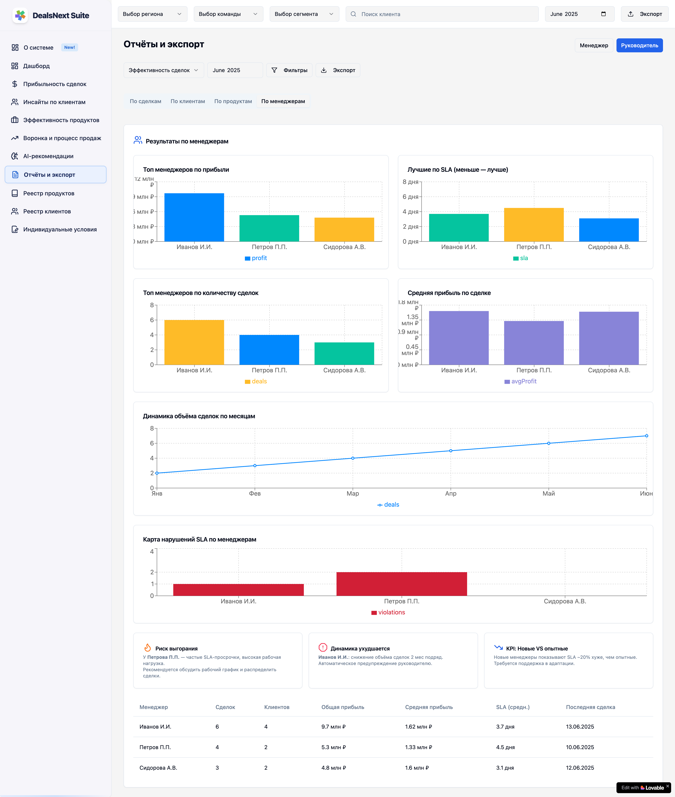

- **Data Visualization:** Explore KPIs, timelines, and trends.
- **Interactive Graphs:** Click-through for deeper insights.

---

### Product Card

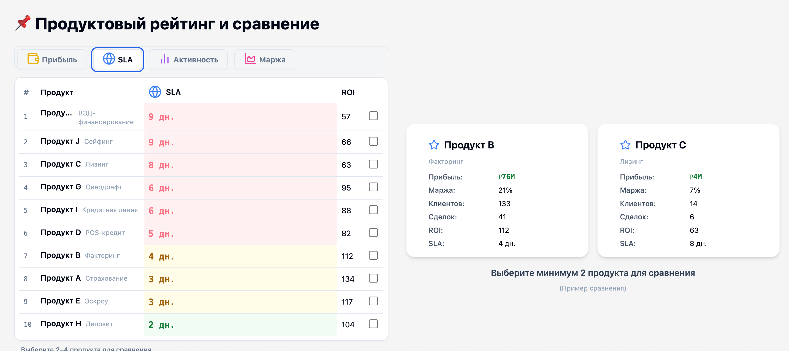

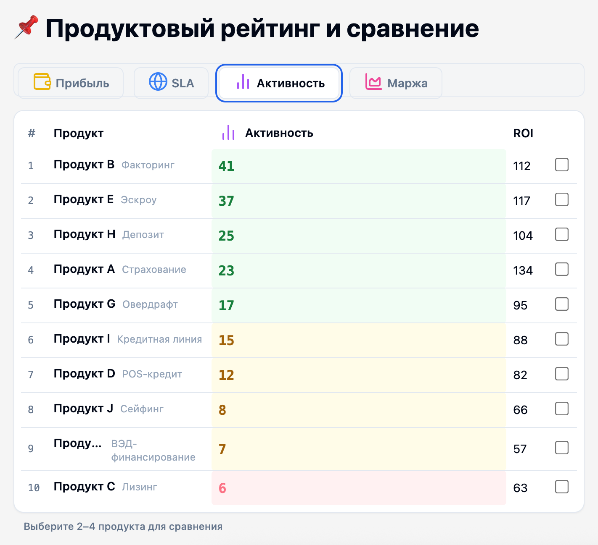

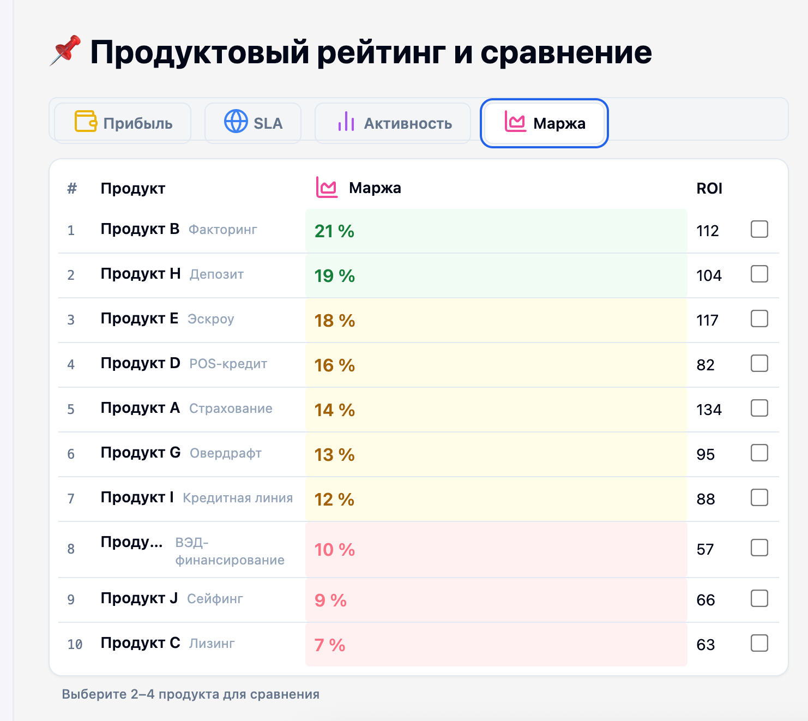

- **Key Info:** See product rating, ROI, margin.
- **Expandable Details:** Get a full performance breakdown.

---

### Clients Table

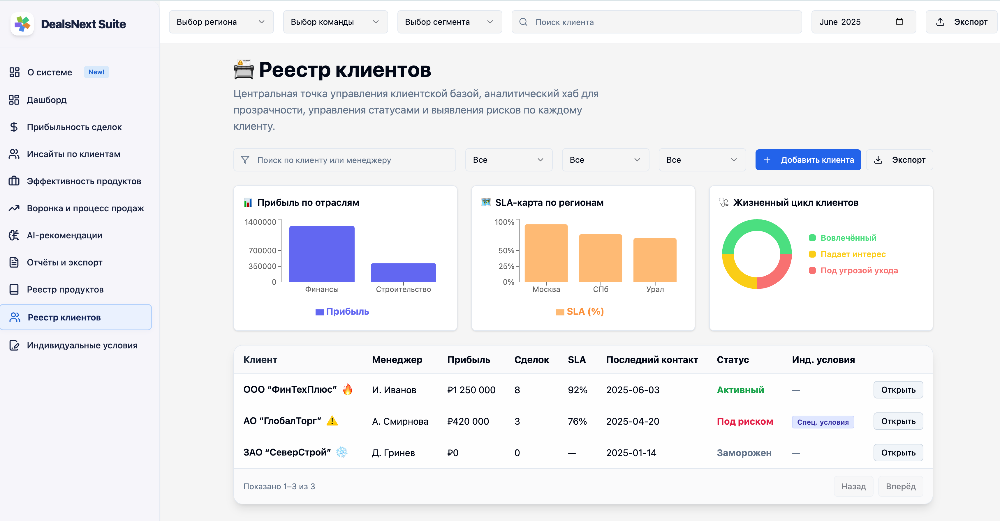

- **Client Segmentation:** Drill into top/bottom client groups.
- **Action Shortcuts:** View client details, trends, and history.

---

### Developer/Analytics View

- **Technical Analytics:** For advanced users or developers.
- **Code Integration:** Example of code view for custom data analysis.

---

## 🇷🇺 Русский

Добро пожаловать в интерфейс DealsNextV0!  
Здесь представлен расширенный обзор ключевых экранов и описания основных модулей.

---

### Раздел о системе (пояснение о чем продукт и т п)

### Дашборд

- **KPIs в реальном времени:** Основные показатели и графики прибыли.
- **AI-инсайты:** Рекомендации по росту и сигналы рисков.
- **Быстрая навигация:** Переход к Продуктам, Сделкам, Условиям, Аналитике, AI Growth.

---

### Реестр продуктов

- **Жизненный цикл:** Аналитика по кварталам, сравнения.
- **Таблица сравнения:** Сортировка и сравнение рейтингов.
- **Прогноз маржи:** Интерактивные аналитические графики.

---

### Индивидуальные условия

- **Гибкие условия:** Скидки, комиссии, рассрочки.
- **Влияние:** Мгновенный пересчет прибыльности сделки.

---

### AI Growth

- **Авто-инсайты:** Новые возможности и риски.
- **Прогноз эффектов:** Яркая визуализация итоговых показателей по SLA и марже.

---

### Список сделок

- **Полный перечень:** Удобная навигация и фильтрация.
- **Статусы:** Визуальные индикаторы успешности сделки.
- **Массовые действия:** Быстрое обновление или экспорт списка.

---

### Аналитика

- **Визуализация:** Графики трендов, KPI по периодам.
- **Глубокие данные:** Кликабельные элементы для быстрого перехода к деталям.

---

### Карточка продукта

- **Ключевые метрики:** Рейтинг, прибыль, маржа.
- **Раскрытие:** Детальная история продаж/результатов.

---

### Клиенты

)

- **Сегментация:** Отбор ведущих и менее успешных клиентов.
- **Быстрый доступ:** История и тренды по каждому клиенту.

---

### Тех.раздел/Код

- **Техноподдержка/разработчикам:** Пример вида с технической детализацией.
- **Возможность интеграции кода:** Для кастомного анализа.

---

*Note: Screenshots are demo images. You can replace them with real system screens by uploading your images to `public/screenshots/` and updating the paths above.*

