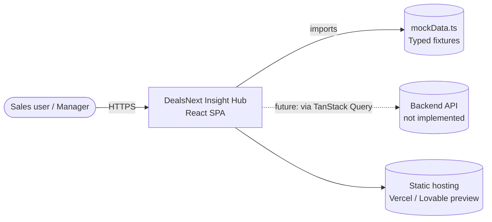
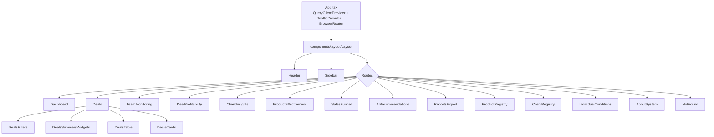
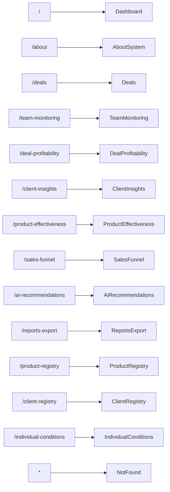
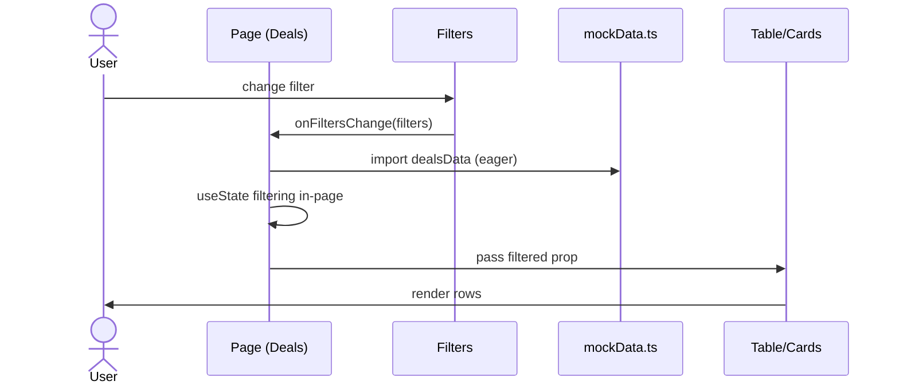
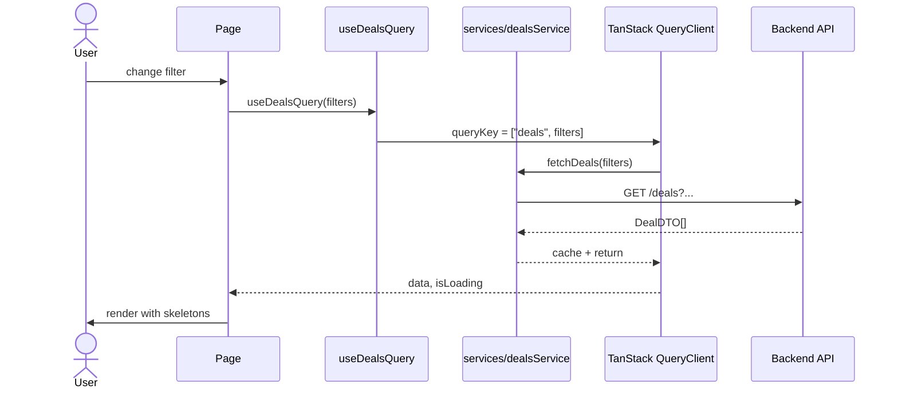

# Architecture — DealsNext Insight Hub

> Companion to [README](../README.md), [PRD](PRD.md), and [IMPROVEMENTS](IMPROVEMENTS.md). This document describes the *current* shape of the system and the *target* shape we are migrating toward.

---

## 1. Goals & non-goals

**Goals**

- Maintainable, recruiter-readable front-end architecture that demonstrates production engineering taste.
- Clear separation between route-level pages, feature-scoped composites, and vendored UI primitives.
- A data layer that can be swapped from typed mocks to a real backend without touching the page tree.
- Tooling and conventions that make `npm install && npm run dev` work for a new contributor in under a minute.

**Non-goals**

- Backend / API implementation. The system is consciously front-end-only in `v0.1`.
- Authentication, RBAC, multi-tenancy. Assumed to come from a host org's SSO when productionised.
- A monorepo. The project is a single application; no Nx / Turborepo overhead.
- A custom design system. We compose on top of [shadcn/ui](https://ui.shadcn.com/) instead of building primitives from scratch.

---

## 2. High-level overview

DealsNext Insight Hub is a single-page React application served as a static bundle. A `BrowserRouter` switches between thirteen route components; each route is a thin orchestrator that composes feature-scoped components and reads from a typed mock-data module. State that crosses a screen boundary lives in URL/query params or in a local `useState`; state that should be cached across screens is the future job of TanStack Query (already provisioned via `QueryClientProvider`, but no queries are defined in `v0.1`).

There is no backend in `v0.1`. The current bottleneck for evolution is the data layer: pages import fixtures directly. The target architecture (Section 7) hides that behind a service layer and per-feature query hooks.

---

## 3. System context

The dashed edge to `API` is the migration target tracked in [`IMPROVEMENTS.md`](IMPROVEMENTS.md) (`IMP-04`, `IMP-05`).

---

## 4. Component tree

The shell (`Layout` + `Header` + `Sidebar`) is stable; pages are interchangeable orchestrators of feature-scoped components living under `components/<feature>/`.

---

## 5. Routing

Single-level flat routes, no nested layouts, single `Layout` wrapper. Defined in [`src/App.tsx:33-47`](../src/App.tsx).

| Path | Page | Purpose |
| --- | --- | --- |
| `/` | `Dashboard` | KPIs, AI insights, quick navigation |
| `/about` | `AboutSystem` | Onboarding & system overview |
| `/deals` | `Deals` | Full pipeline with filters and bulk actions |
| `/team-monitoring` | `TeamMonitoring` | Activity, workload, SLA per team member |
| `/deal-profitability` | `DealProfitability` | Margin breakdown per deal |
| `/client-insights` | `ClientInsights` | Segments, trends, LTV |
| `/product-effectiveness` | `ProductEffectiveness` | KPIs per product line |
| `/sales-funnel` | `SalesFunnel` | Stage-by-stage funnel analytics |
| `/ai-recommendations` | `AiRecommendations` | Upsell, cross-sell, churn signals |
| `/reports-export` | `ReportsExport` | Report builder and exports |
| `/product-registry` | `ProductRegistry` | Catalog, comparison, profit forecast |
| `/client-registry` | `ClientRegistry` | Master client list with segmentation |
| `/individual-conditions` | `IndividualConditions` | Custom contract terms and their impact |
| `*` | `NotFound` | 404 fallback |

All routes are currently eager-imported, which costs first-load bundle size. Route-level code splitting is `IMP-11` in the roadmap.

---

## 6. Data flow — current (mock-driven)

Observations:

- The `filters` payload is passed as `any` between `DealsFilters` and the page (`IMP-01`). The page contains the filtering logic inline (`IMP-06`).
- `mockData.ts` is imported eagerly at module load. Every page pays the cost regardless of whether it uses that slice.
- `QueryClientProvider` is mounted in [`App.tsx:24,27`](../src/App.tsx) but no `useQuery` exists yet. The cache is empty.

---

## 7. Data flow — target (post-IMPROVEMENTS)

Key shifts versus today:

- **Page no longer owns filtering logic** — it composes a query hook and renders the result.
- **Mock data is hidden behind a service module** with the same interface as the real API client.
- **Cache, retries, deduping, optimistic updates** are all free via TanStack Query once we use it.
- **Each filter combination is a distinct query key**, which means the browser back button instantly restores state.

Migration path: `IMP-04` activates the provider with a real `useQuery`; `IMP-05` introduces `src/services/`; `IMP-06` lifts filter logic out of pages.

---

## 8. Layers & module responsibilities

| Layer | Path | Responsibility | Notes |
| --- | --- | --- | --- |
| Bootstrap | `src/main.tsx` | Mount React, import global CSS. | No logic. |
| Providers + routes | `src/App.tsx` | `QueryClientProvider`, `TooltipProvider`, `BrowserRouter`, `Routes`, toast roots. | Single source of route truth. |
| Layout shell | `src/components/layout/` | `Header`, `Sidebar`, `Layout`. | Persistent chrome around every route. |
| Pages | `src/pages/` | Route-level orchestrators. | One file per route; should stay thin (≤ 150 lines target). |
| Feature components | `src/components/<feature>/` | Composites for a single feature. | E.g. `deals/DealsTable.tsx`, `team-monitoring/TeamKpiCards.tsx`. |
| UI primitives | `src/components/ui/` | Vendored shadcn/ui (Radix-based). | **Do not edit** — treat as a third-party package. |
| Data | `src/data/mockData.ts` | Typed fixtures. | Migration target: replace with `src/services/`. |
| Hooks | `src/hooks/` | Cross-cutting hooks. | Domain hooks (`useDealsQuery`, etc.) will live here once `IMP-04` lands. |
| Utilities | `src/lib/` | Pure helpers (formatters, `cn`, etc.). | No React imports. |

---

## 9. State management

| Concern | Today | Target |
| --- | --- | --- |
| **Server state** | None — fixtures imported as modules. | TanStack Query per feature (`useDealsQuery`, `useClientsQuery`, …). |
| **URL state** | Minimal. | Filters and selected entity encoded in the URL (`useSearchParams`). |
| **Local component state** | `useState` per page. | Same, but only for ephemeral UI (open drawer, hover, etc.). |
| **Cross-feature state** | None. | None planned — TanStack Query's cache is the only shared state. |

We deliberately avoid Redux / Zustand / Context-based stores. The combination of (a) URL state for navigation and filters, (b) TanStack Query for server state, and (c) local `useState` for ephemeral UI covers the entire spec without a global store.

---

## 10. Design system

- **Foundation.** Tailwind CSS 3.4 with `tailwindcss-animate` and `@tailwindcss/typography`. Theme tokens defined as HSL CSS variables in `src/index.css`; switched between light and dark via `next-themes`.
- **Primitives.** 49 vendored shadcn/ui components in `src/components/ui/`. They wrap Radix primitives and apply our Tailwind theme. Vendored = we own the code, but we treat it like an upstream package: no edits, only composition.
- **Composition.** Feature components import primitives and assemble them. The `cn()` helper in `src/lib/utils.ts` merges Tailwind class strings.
- **Icons.** Lucide. One icon set, consistent stroke weight.
- **Charts.** Recharts. All charts are wrapped in a feature component so swapping libraries is a single-file change.

---

## 11. Build & tooling

| Concern | Choice | Notes |
| --- | --- | --- |
| Bundler | Vite 5 + `@vitejs/plugin-react-swc` | SWC for fast TS transpilation. |
| Dev port | `8080` | Configured in `vite.config.ts`. |
| Path alias | `@/* → src/*` | Configured in `vite.config.ts:18-20` and `tsconfig.json`. |
| Linting | ESLint 9 flat config (`eslint.config.js`) | Relaxed defaults today — `IMP-14` tightens them. |
| Formatting | None | `IMP-15` adds Prettier + Husky + lint-staged. |
| Type checking | TypeScript 5.5 | `strictNullChecks`, `noImplicitAny`. |
| Testing | None | `IMP-13` adds Vitest + React Testing Library. |
| CI/CD | None | `IMP-19` adds GitHub Actions for lint + build + test. |

---

## 12. Folder conventions

- **One feature, one folder** under `src/components/`. Cross-feature components either move to `components/layout/` or get promoted to `components/ui/`.
- **Pages do not import each other.** A page renders a tree of feature components; it never imports another page.
- **Mock data is imported only from pages or domain hooks**, never from primitive components.
- **`components/ui/` is read-only**, even for bug fixes. If a primitive is missing a prop, wrap it in a feature component.
- **No barrel `index.ts` files** for now. They obscure the file each symbol comes from and slow Vite's dependency graph.

---

## 13. Known constraints & technical debt

Tracked in detail in [`IMPROVEMENTS.md`](IMPROVEMENTS.md). Headline items as of `v0.1`:

- `filters: any` props leak `any` through several pages (`IMP-01`).
- `QueryClient` is created but unused (`IMP-04`).
- Eager route imports inflate first-load bundle (`IMP-11`).
- No tests, no CI (`IMP-13`, `IMP-19`).
- `lovable-tagger` and `public/lovable-uploads/` are legacy artefacts to remove (`IMP-17`).
- `src/components/ui/sidebar.tsx` (761 lines) is a **vendored shadcn primitive** — not a refactor target.

---

## 14. Architecture Decision Records

Significant architectural decisions are captured as ADRs under [`docs/adr/`](adr/). The first concrete record will be added when we make the first decision that cannot be inferred from the code (e.g. choosing a backend protocol). See [`docs/adr/README.md`](adr/README.md) for the template and process.
