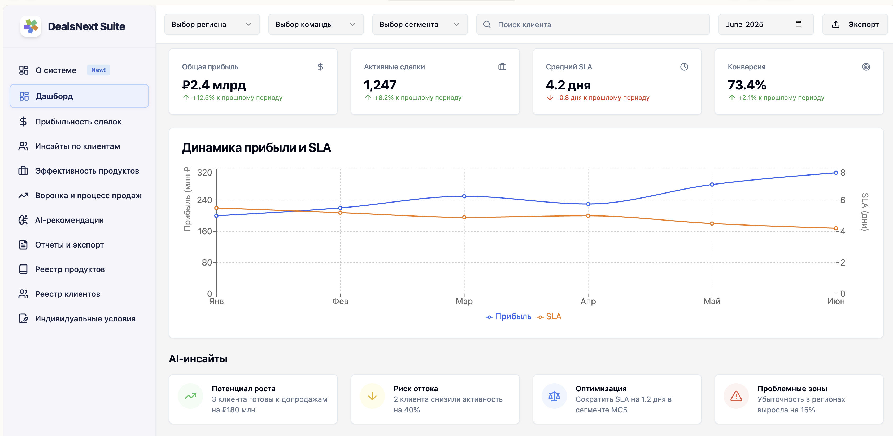
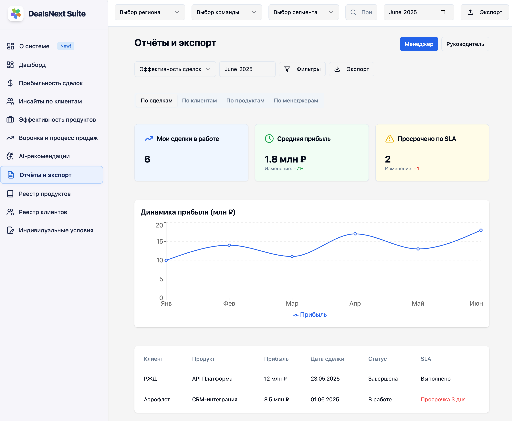
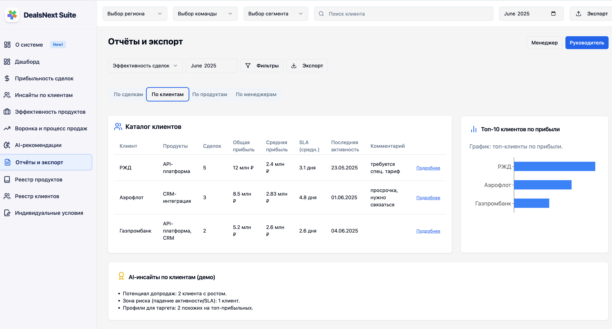
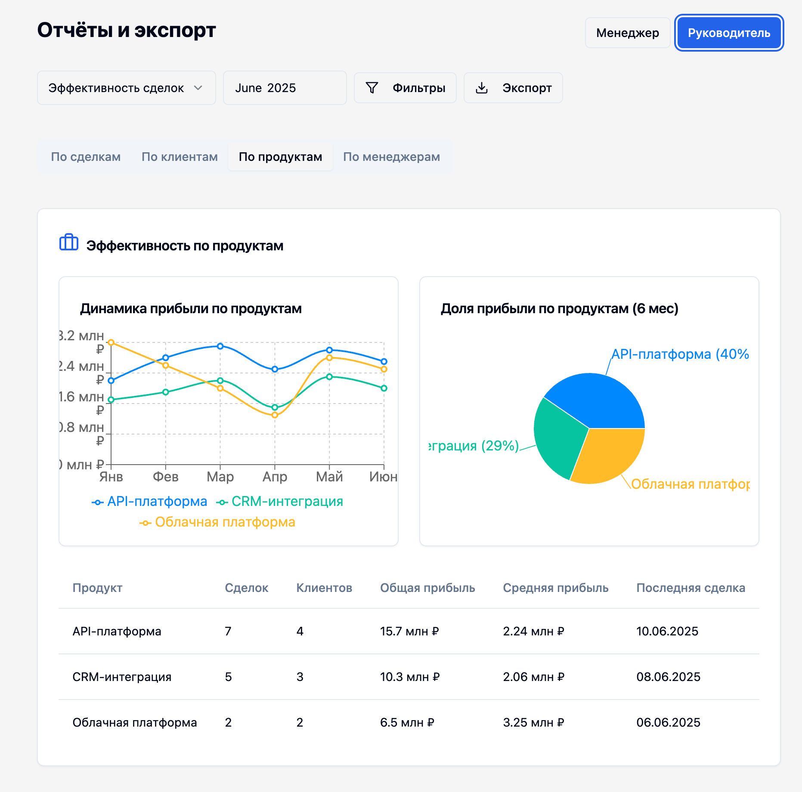
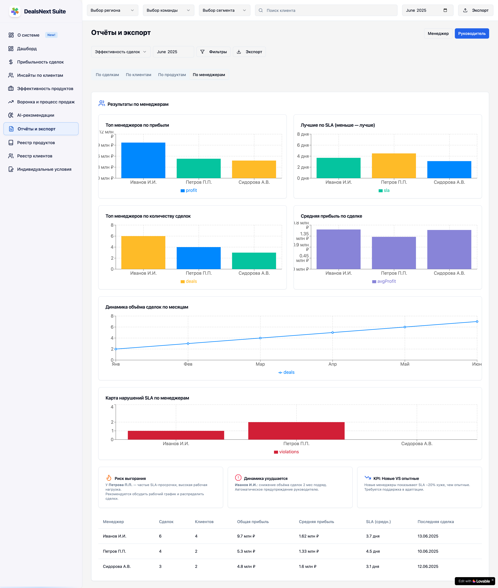
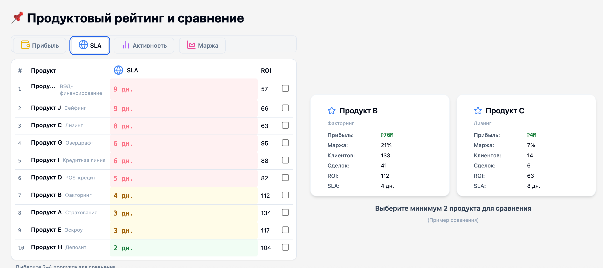
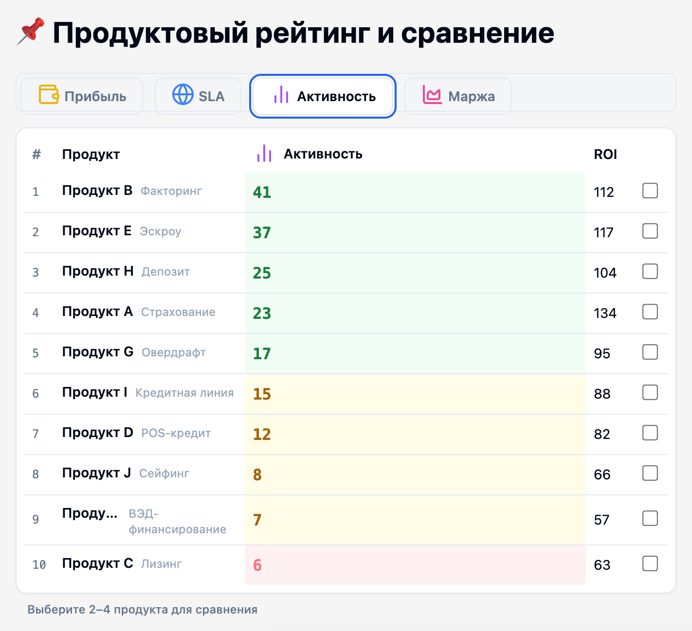
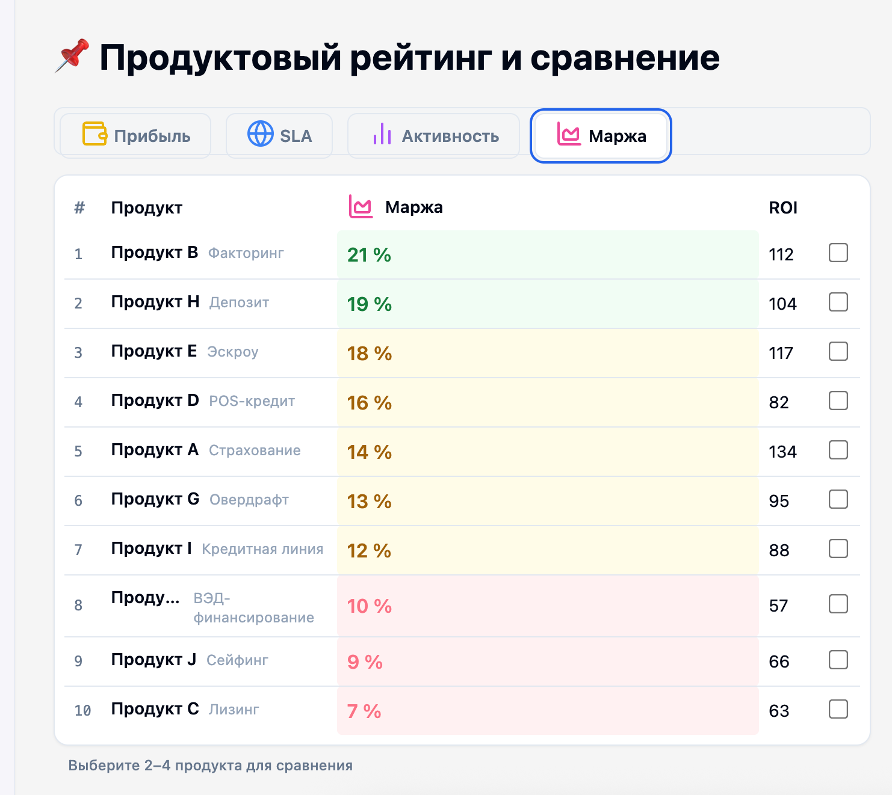
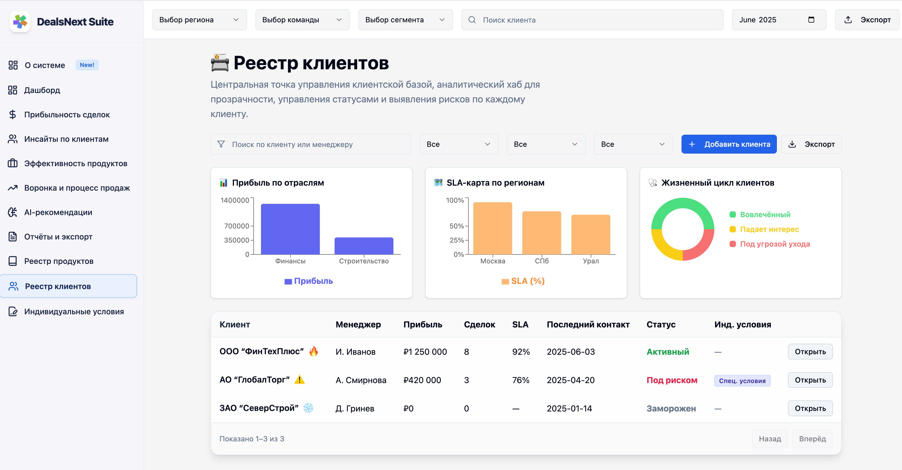
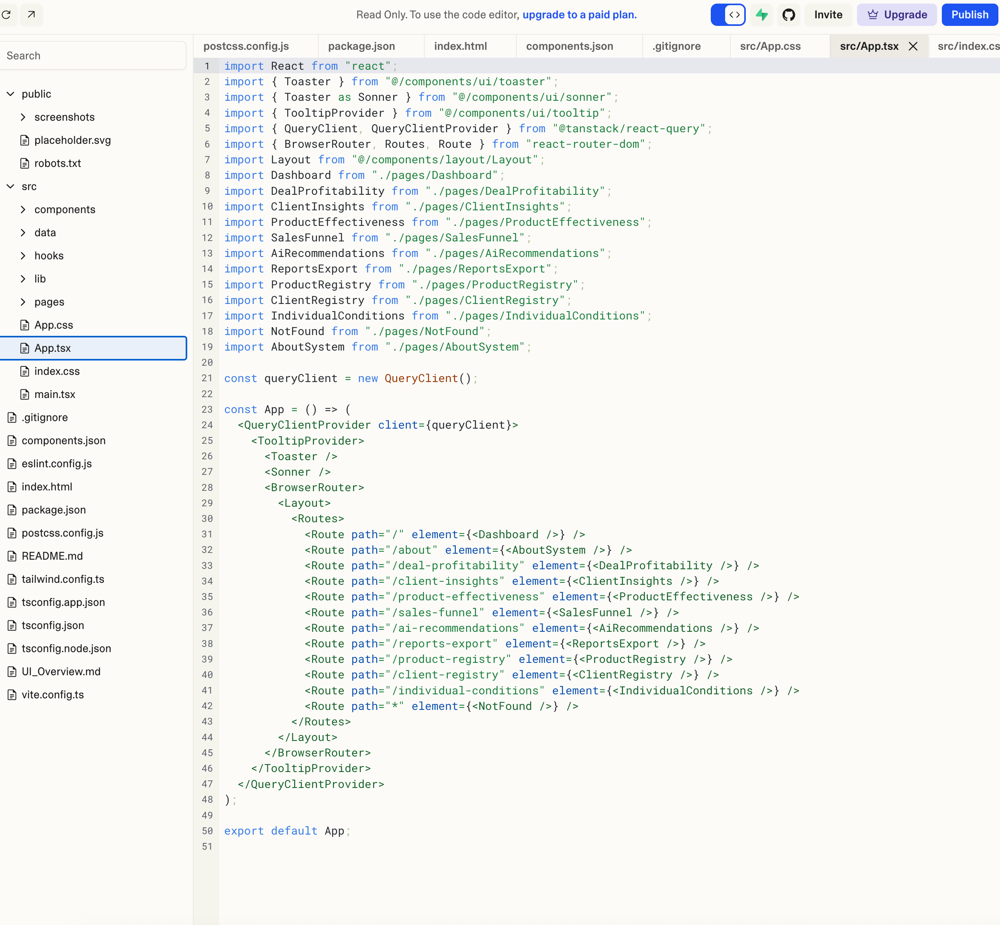

# Interface Overview / Обзор интерфейса

> Companion to [README](../README.md). For architecture see [ARCHITECTURE.md](ARCHITECTURE.md). For product context see [PRD.md](PRD.md).

---

## English

Welcome to the DealsNext Insight Hub interface tour. Below is a screen-by-screen walkthrough of the main modules with annotated screenshots.

---

### About system (onboarding)

A short orientation surface for first-time users — what the product does, where to start, who it is for.

---

### Dashboard

*Placeholder image — replace with a real dashboard capture in a future pass.*

- **Live KPIs.** Quick stats and profit visualization.
- **AI insights.** Growth recommendations and risk signals.
- **Quick navigation.** Jump to Products, Deals, Conditions, Analytics, AI Growth.

---

### Product Registry

- **Product lifecycle.** Track product performance and profit over time.
- **Comparison table.** View, sort, and compare products.
- **Profit forecast.** Interactive charts and analytics.

---

### Individual Conditions

- **Custom terms.** Discounts, installments, and commissions.
- **Impact highlight.** Deal profitability is recalculated in real time.

---

### AI Growth Module

- **Automatic insights.** Upsell / cross-sell opportunities and risk alerts.
- **Effect forecast.** Visualised SLA and margin improvement.

---

### Deals List

- **Full deal list.** Easy navigation and filtering.
- **Status indicators.** Understand deal health at a glance.
- **Bulk actions.** Quickly update, export, or archive deals.

---

### Analytics Overview

- **Data visualization.** Explore KPIs, timelines, and trends.
- **Interactive graphs.** Click-through for deeper insights.

---

### Product Card

- **Key info.** Product rating, ROI, margin.
- **Expandable details.** Full performance breakdown.

---

### Clients Table

- **Client segmentation.** Drill into top / bottom client groups.
- **Action shortcuts.** View client details, trends, and history.

---

### Developer / Analytics View

- **Technical analytics.** For advanced users or developers.
- **Code integration.** Example of a code view for custom data analysis.

---

## Русский

Добро пожаловать в тур по интерфейсу DealsNext Insight Hub. Ниже — пошаговый обзор ключевых модулей с аннотированными скриншотами.

---

### Раздел о системе (онбординг)

Короткое введение для новых пользователей — что делает продукт, с чего начать, для кого он.

---

### Дашборд

*Изображение-плейсхолдер — заменить на реальный скриншот дашборда в следующей итерации.*

- **KPI в реальном времени.** Основные показатели и графики прибыли.
- **AI-инсайты.** Рекомендации по росту и сигналы рисков.
- **Быстрая навигация.** Переход к Продуктам, Сделкам, Условиям, Аналитике, AI Growth.

---

### Реестр продуктов

- **Жизненный цикл.** Аналитика по кварталам, сравнения.
- **Таблица сравнения.** Сортировка и сравнение рейтингов.
- **Прогноз маржи.** Интерактивные аналитические графики.

---

### Индивидуальные условия

- **Гибкие условия.** Скидки, комиссии, рассрочки.
- **Влияние.** Мгновенный пересчёт прибыльности сделки.

---

### AI Growth

- **Авто-инсайты.** Новые возможности и риски.
- **Прогноз эффектов.** Яркая визуализация итоговых показателей по SLA и марже.

---

### Список сделок

- **Полный перечень.** Удобная навигация и фильтрация.
- **Статусы.** Визуальные индикаторы успешности сделки.
- **Массовые действия.** Быстрое обновление или экспорт списка.

---

### Аналитика

- **Визуализация.** Графики трендов, KPI по периодам.
- **Глубокие данные.** Кликабельные элементы для быстрого перехода к деталям.

---

### Карточка продукта

- **Ключевые метрики.** Рейтинг, прибыль, маржа.
- **Раскрытие.** Детальная история продаж и результатов.

---

### Клиенты

- **Сегментация.** Отбор ведущих и менее успешных клиентов.
- **Быстрый доступ.** История и тренды по каждому клиенту.

---

### Тех-раздел / Код

- **Техподдержка / разработчикам.** Пример вида с технической детализацией.
- **Возможность интеграции кода.** Для кастомного анализа.
